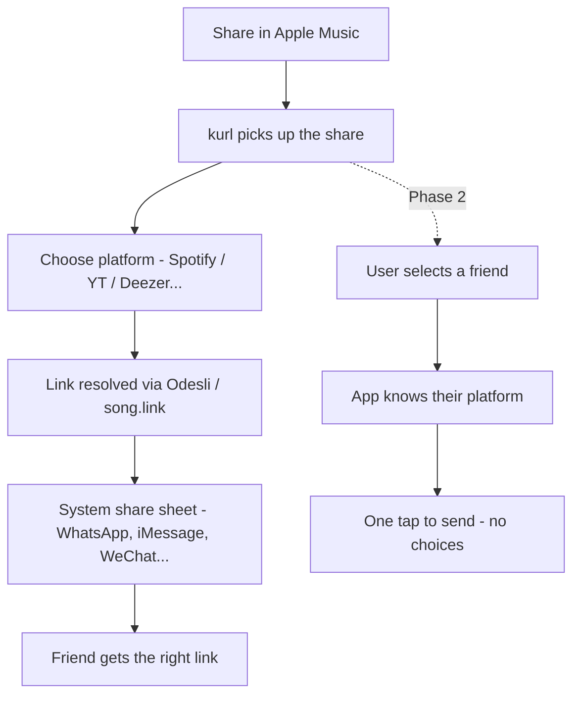

# kurl

> Share any song. To anyone. On any streaming service.

kurl intercepts music share links and converts them to whatever streaming service your friend actually uses - no account needed, no friction, no "sorry I'm on Spotify not Apple Music".

---

## The problem

You're on Apple Music. Your mate is on Spotify. You want to share a track. The current flow is:
1. Copy the link
2. Hope they have the same service
3. They don't
4. They Google it manually

kurl fixes this in two taps.

---

## How it works

### Anonymous (phase 1)
1. Hit **Share** on any song in any streaming app
2. kurl shows up in the share sheet
3. Pick the recipient's platform (Spotify, Apple Music, YouTube Music, Deezer, Tidal...)
4. kurl resolves the equivalent link via Odesli
5. System share sheet opens - send via WhatsApp, iMessage, WeChat, whatever

### With account (phase 2)
1. Hit **Share**, pick a friend from kurl contacts
2. App already knows their preferred platform
3. Link resolved and shared in one tap - done

---

## Status

Planning / pre-build.

---

## Docs

- [Architecture](_docs/ARCHITECTURE.md) - tech stack, project structure, why SQLite
- [API](_docs/API.md) - endpoint details
- [Development](_docs/DEVELOPMENT.md) - local setup, packages
- [Roadmap](_docs/ROADMAP.md) - phases, supported platforms
