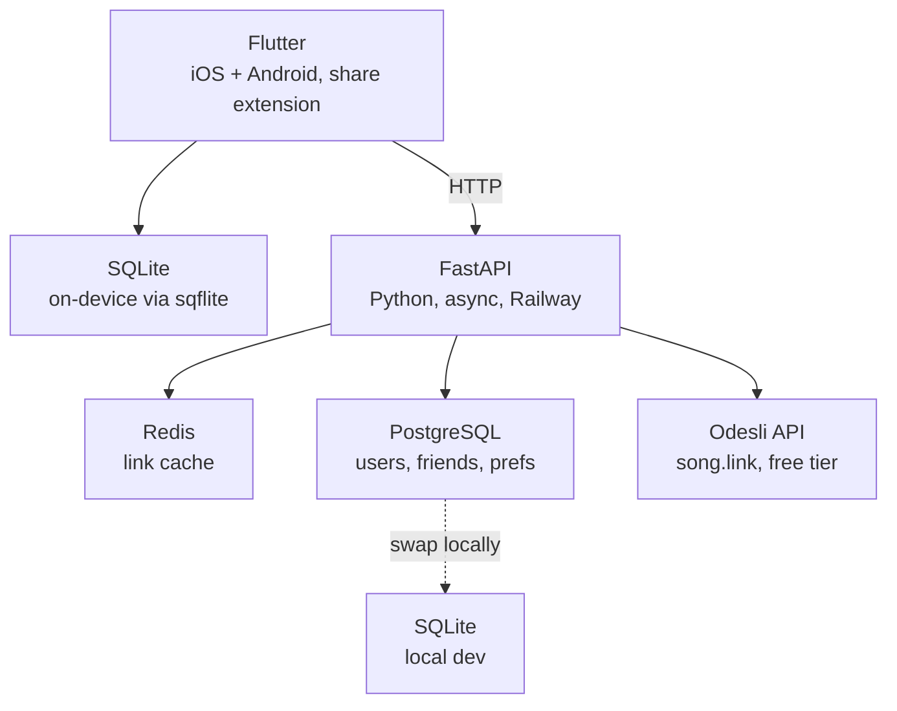

# Architecture

## Tech stack



### Why SQLite stays

SQLite sits on-device. It handles prefs, link cache, and friend list sync - everything that doesn't need a server. Postgres only comes in at phase 2 for the user/friend graph. `sqflite` works, it's free, no reason to overcomplicate it.

---

## Project structure

```
kurl/
├── mobile/                          # Flutter app
│   ├── lib/
│   │   ├── main.dart
│   │   ├── app.dart
│   │   ├── core/
│   │   │   ├── constants.dart       # platform names, colours, config
│   │   │   ├── router.dart          # Go Router config
│   │   │   └── theme.dart
│   │   ├── data/
│   │   │   ├── db/
│   │   │   │   ├── database.dart    # SQLite init + migrations
│   │   │   │   └── prefs_dao.dart   # user pref queries
│   │   │   ├── models/
│   │   │   │   ├── platform.dart    # streaming platform enum
│   │   │   │   ├── resolve_result.dart
│   │   │   │   └── friend.dart      # phase 2
│   │   │   └── repositories/
│   │   │       ├── url_repository.dart    # calls backend, caches locally
│   │   │       └── friend_repository.dart # phase 2
│   │   ├── services/
│   │   │   ├── share_service.dart   # incoming share intent
│   │   │   └── clipboard_service.dart
│   │   └── ui/
│   │       ├── share/
│   │       │   ├── share_screen.dart       # main share flow
│   │       │   └── platform_picker.dart    # platform selection sheet
│   │       ├── settings/
│   │       │   └── settings_screen.dart    # preferred platform, account
│   │       └── friends/                    # phase 2
│   │           ├── friends_screen.dart
│   │           └── add_friend_screen.dart
│   ├── android/
│   │   └── app/src/main/
│   │       └── AndroidManifest.xml  # share intent filter
│   ├── ios/
│   │   └── Runner/
│   │       └── Info.plist           # share extension config
│   └── pubspec.yaml
│
├── backend/                         # FastAPI
│   ├── app/
│   │   ├── main.py
│   │   ├── config.py                # env vars, settings
│   │   ├── routers/
│   │   │   ├── urls.py              # POST /api/kurl
│   │   │   └── users.py             # phase 2 - auth, profile
│   │   ├── services/
│   │   │   ├── odesli.py            # Odesli API client
│   │   │   └── cache.py             # Redis helpers
│   │   ├── models/
│   │   │   └── schemas.py           # Pydantic models
│   │   └── db/
│   │       └── postgres.py          # phase 2 - SQLAlchemy async
│   ├── requirements.txt
│   ├── Dockerfile
│   └── railway.toml
│
└── README.md
```
