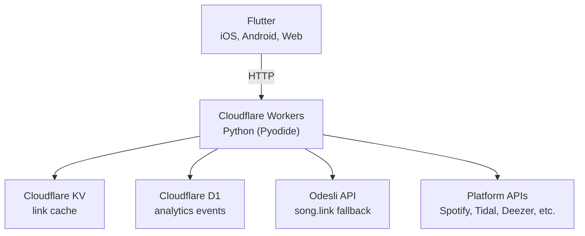

# Architecture

## Tech stack



## Project structure

```
kurl/
├── app/                             # Flutter app
│   ├── lib/
│   │   ├── main.dart
│   │   ├── app/
│   │   │   ├── app.dart
│   │   │   ├── config.dart          # API base URL, API key
│   │   │   └── routes/
│   │   │       └── kurl.dart        # main kurl screen
│   │   ├── models/
│   │   │   ├── kurl_result.dart
│   │   │   └── platform.dart        # platform enum, icons, colours
│   │   ├── services/
│   │   │   ├── api_service.dart     # POST /api/kurl
│   │   │   └── analytics_service.dart # fire-and-forget event tracking
│   │   ├── utils/
│   │   │   └── url_validator.dart
│   │   └── widgets/
│   │       └── shared/
│   │           ├── platform_picker.dart
│   │           ├── result_card.dart
│   │           └── marquee_text.dart
│   └── pubspec.yaml
│
├── backend/                         # Cloudflare Workers Python
│   ├── entry.py                     # WorkerEntrypoint (fetch handler)
│   ├── wrangler.toml                # Worker config, D1 + KV bindings
│   ├── pyproject.toml               # Python deps (httpx, PyJWT)
│   ├── api/
│   │   ├── router.py                # route decorator + resolve()
│   │   ├── middleware/
│   │   │   ├── auth.py              # API key validation
│   │   │   └── rate_limit.py        # write endpoint throttling
│   │   ├── controllers/
│   │   │   └── events_controller.py # analytics business logic
│   │   ├── routes/
│   │   │   └── events.py            # event HTTP handlers
│   │   └── services/
│   │       └── urls.py              # kurl resolution logic
│   ├── clients/
│   │   ├── cache.py                 # KV wrapper
│   │   ├── odesli.py                # Odesli API client
│   │   ├── metadata.py              # HTML scraping fallback
│   │   └── platforms/               # per-platform API clients
│   │       ├── spotify.py
│   │       ├── apple.py
│   │       ├── deezer.py
│   │       ├── tidal.py
│   │       ├── youtube.py
│   │       └── soundcloud.py
│   ├── db/
│   │   ├── db.py                    # D1 query helpers
│   │   ├── schemas/
│   │   │   └── events.sql           # events table DDL
│   │   └── queries/
│   │       └── events.py            # event SQL statements
│   ├── models/
│   │   └── event.py                 # event field mapping
│   ├── app/
│   │   ├── config.py                # env vars, settings
│   │   └── constants.py             # platform sets, URL templates
│   └── utils/
│       ├── response.py              # JSON response builders
│       ├── errors.py                # ApiError exception
│       ├── uid.py                   # prefixed UID generator
│       ├── url_parser.py            # music URL parsing
│       ├── kurler.py                # ISRC/UPC resolution
│       └── logging.py
│
├── _docs/                           # documentation
└── .github/workflows/kurl.yml      # CI/CD pipeline
```
