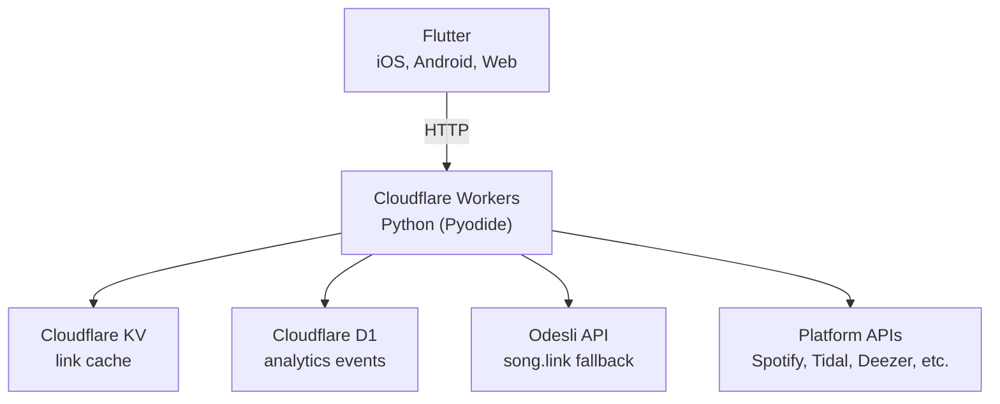

# kurl docs

Reference documentation.

## Index

| Doc | Purpose |
|---|---|
| [API.md](API.md) | Endpoints, request/response shape, error codes |
| [PLATFORMS.md](PLATFORMS.md) | Supported platforms, brand colours, icons |
| [ISRC_KURLER.md](ISRC_KURLER.md) | Direct platform resolution logic, client interface |
| [SHARE_EXTENSION.md](SHARE_EXTENSION.md) | iOS share extension setup |
| [UNIVERSAL_LINKS.md](UNIVERSAL_LINKS.md) | Deep linking setup |

## Architecture

### Tech stack



### Project structure

```
kurl/
├── app/                             # Flutter app
│   ├── lib/
│   │   ├── main.dart
│   │   ├── app/
│   │   │   ├── app.dart
│   │   │   ├── config.dart          # API base URL, API key
│   │   │   └── routes/
│   │   │       └── kurl.dart        # main kurl screen
│   │   ├── models/
│   │   │   ├── kurl_result.dart
│   │   │   └── platform.dart        # platform enum, icons, colours
│   │   ├── services/
│   │   │   ├── api_service.dart     # POST /api/kurl
│   │   │   └── analytics_service.dart # fire-and-forget event tracking
│   │   ├── utils/
│   │   │   └── url_validator.dart
│   │   └── widgets/
│   │       └── shared/
│   │           ├── platform_picker.dart
│   │           ├── result_card.dart
│   │           └── marquee_text.dart
│   └── pubspec.yaml
│
├── backend/                         # Cloudflare Workers Python
│   ├── entry.py                     # WorkerEntrypoint (fetch handler)
│   ├── wrangler.toml                # Worker config, D1 + KV bindings
│   ├── pyproject.toml               # Python deps (httpx, PyJWT)
│   ├── api/
│   │   ├── router.py                # route decorator + resolve()
│   │   ├── middleware/
│   │   │   ├── auth.py              # API key validation
│   │   │   └── rate_limit.py        # write endpoint throttling
│   │   ├── controllers/
│   │   │   └── events_controller.py # analytics business logic
│   │   ├── routes/
│   │   │   └── events.py            # event HTTP handlers
│   │   └── services/
│   │       └── urls.py              # kurl resolution logic
│   ├── clients/
│   │   ├── cache.py                 # KV wrapper
│   │   ├── odesli.py                # Odesli API client
│   │   ├── metadata.py              # HTML scraping fallback
│   │   └── platforms/               # per-platform API clients
│   │       ├── spotify.py
│   │       ├── apple.py
│   │       ├── deezer.py
│   │       ├── tidal.py
│   │       ├── youtube.py
│   │       └── soundcloud.py
│   ├── db/
│   │   ├── db.py                    # D1 query helpers
│   │   ├── schemas/
│   │   │   └── events.sql           # events table DDL
│   │   └── queries/
│   │       └── events.py            # event SQL statements
│   ├── models/
│   │   └── event.py                 # event field mapping
│   ├── app/
│   │   ├── config.py                # env vars, settings
│   │   └── constants.py             # platform sets, URL templates
│   └── utils/
│       ├── response.py              # JSON response builders
│       ├── errors.py                # ApiError exception
│       ├── uid.py                   # prefixed UID generator
│       ├── url_parser.py            # music URL parsing
│       ├── kurler.py                # ISRC/UPC resolution
│       └── logging.py
│
├── _docs/                           # documentation
└── .github/workflows/kurl.yml      # CI/CD pipeline
```

## References

### Odesli (song.link)

The API kurl uses as a fallback when direct ISRC resolution fails.

- API base: `https://api.song.link/v1-alpha.1/links`
- Pass a streaming URL, get back `linksByPlatform` with URLs for every platform the track exists on
- Also returns `entitiesByUniqueId` with track metadata (title, artist, ISRC)
- Free tier works without an API key, has rate limits
- Matching is done via ISRC codes internally
- Docs: https://odesli.co

### ISRC resolver capability matrix

Every properly distributed track gets the same ISRC across all platforms. Used by `utils/kurler.py` to skip Odesli when source + target both expose ISRC.

| Platform | Get ISRC from link | Search by ISRC | API access |
|---|---|---|---|
| Spotify | Yes (`external_ids.isrc`) | Yes (`isrc:` filter) | Free, OAuth client credentials |
| Apple Music | Yes (track metadata) | Yes (batch up to 25) | Free, Apple Developer account |
| Deezer | Yes (track object) | Yes (undocumented `/track/isrc:{code}`) | Free, no auth |
| Tidal | Yes (track metadata) | Yes | Developer portal |
| YouTube Music | No | No public ISRC search | No official music API |
| Amazon Music | No | No | Closed |
| Beatport | No (partner-only API) | No public API | Partner approval required |
| Bandcamp | No (deprecated 2014) | No | Closed |

For YouTube/Amazon/Beatport/Bandcamp, fallback to og scrape + fuzzy match on artist and track name.

Useful reference: https://medium.com/@leemartin/how-to-match-tracks-between-spotify-and-apple-music-2d6b6159957e

### Prior art

- **SubmitHub Links** - landing page builder where artists manually add their own platform links. Linktree for music, not auto-resolution.
- **Songwhip** - shut down in 2023, was similar to Odesli
- **Musicfetch** (musicfetch.io) - paid API for cross-platform matching
- **Linkfire, ToneDen, Feature.fm** - marketing-focused smart link builders, not real-time converters

kurl automates resolution (paste one link, get the equivalent on another platform). Different use case from any of the above.
