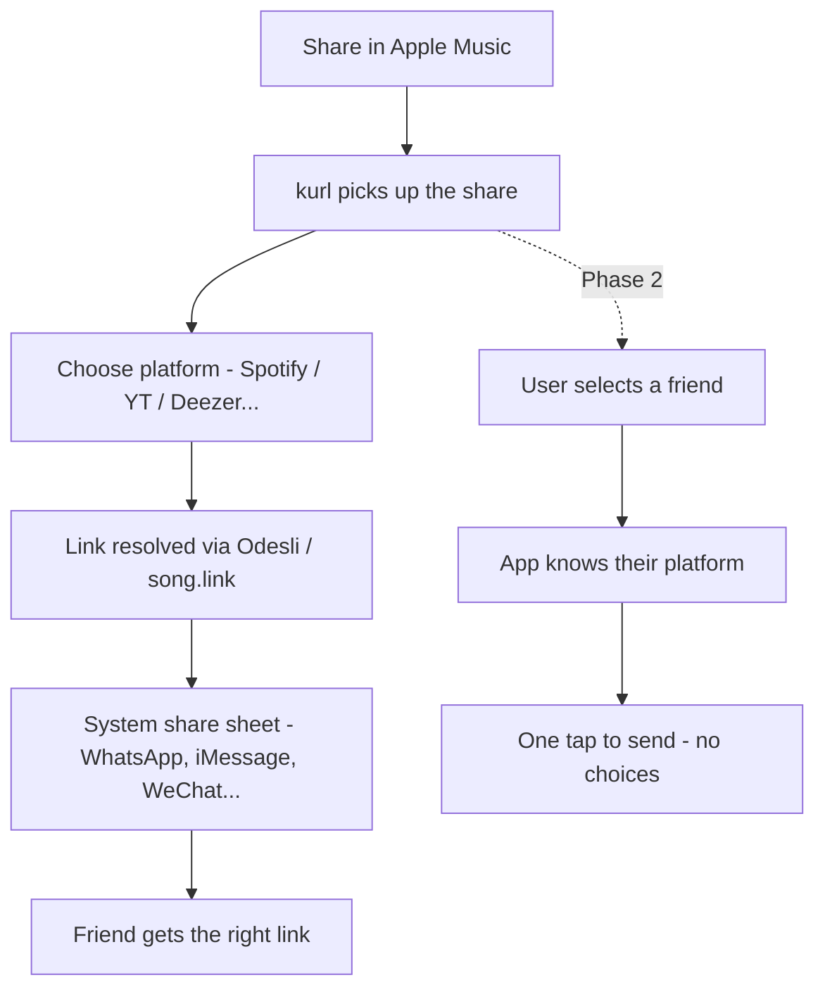

# Roadmap

## The problem

You're on Apple Music. Your mate is on Spotify. You want to share a track. The current flow is:

1. Copy the link
2. Hope they have the same service
3. They don't
4. They Google it manually

kurl fixes this in two taps.

## How it works

### Anonymous (phase 1)

1. Hit **Share** on any song in any streaming app
2. kurl shows up in the share sheet
3. Pick the recipient's platform (Spotify, Apple Music, YouTube Music, Deezer, Tidal...)
4. kurl resolves the equivalent link via Odesli
5. System share sheet opens - send via WhatsApp, iMessage, WeChat, whatever

### With account (phase 2)

1. Hit **Share**, pick a friend from kurl contacts
2. App already knows their preferred platform
3. Link resolved and shared in one tap - done

## Supported platforms (phase 1)

- Spotify
- Apple Music
- YouTube Music
- Deezer
- Tidal
- Amazon Music
- Pandora

Matched via direct platform APIs (Spotify, Apple Music, Deezer, Tidal) with Odesli as fallback. Full list with IDs and colours in [PLATFORMS.md](PLATFORMS.md). ISRC resolution detail in [ISRC_KURLER.md](ISRC_KURLER.md).

## Phase 1 - anonymous MVP

- [x] Flutter share extension on iOS and Android
- [x] Platform picker UI (all 6 platforms wired)
- [x] FastAPI `/api/kurl` endpoint
- [x] Odesli integration
- [x] Redis caching
- [x] System share sheet handoff
- [x] ISRC/UPC resolver with direct platform APIs (Spotify, Deezer, Tidal live; Apple pending Dev Program enrolment)
- [x] Metadata search fallback (YouTube oEmbed → target API)
- [x] Search URL fallback for all 7 platforms
- [x] `/api/readyz` per-client health probe
- [x] CI pipeline (lint + 3.11/3.12 matrix tests + smoke)
- [x] Test suite (94 tests)
- [ ] Preferred platform saved locally (SQLite)
- [ ] Universal links / deep-link into the kurl app from shared URLs
- [ ] App Store + Play Store submission

## Phase 2 - social layer

- [ ] Accounts (email or Sign in with Apple/Google)
- [ ] Friend list with saved platform prefs
- [ ] One-tap share to a known friend
- [ ] Postgres backend for user/friend graph
- [ ] Friend invite flow
