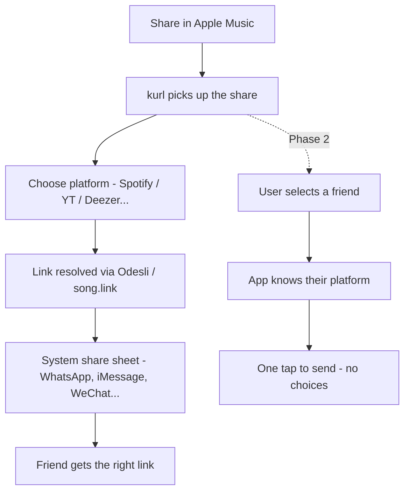

# Roadmap

## The problem

You're on Apple Music. Your mate is on Spotify. You want to share a track. The current flow is:

1. Copy the link
2. Hope they have the same service
3. They don't
4. They Google it manually

kurl fixes this in two taps.

## How it works

### Anonymous (phase 1)

1. Hit **Share** on any song in any streaming app
2. kurl shows up in the share sheet
3. Pick the recipient's platform (Spotify, Apple Music, YouTube Music, Deezer, Tidal...)
4. kurl resolves the equivalent link via Odesli
5. System share sheet opens - send via WhatsApp, iMessage, WeChat, whatever

### With account (phase 2)

1. Hit **Share**, pick a friend from kurl contacts
2. App already knows their preferred platform
3. Link resolved and shared in one tap - done

## Supported platforms (phase 1)

- Spotify
- Apple Music
- YouTube Music
- Deezer
- Tidal
- Amazon Music
- Pandora

All matched via ISRC through Odesli - no direct API deals needed. Full list with IDs and colours in [PLATFORMS.md](PLATFORMS.md).

## Phase 1 - anonymous MVP

- [ ] Flutter share extension on iOS and Android
- [ ] Platform picker UI
- [ ] FastAPI `/api/kurl` endpoint
- [ ] Odesli integration
- [ ] Redis caching
- [ ] System share sheet handoff
- [ ] Preferred platform saved locally (SQLite)
- [ ] App Store + Play Store submission

## Phase 2 - social layer

- [ ] Accounts (email or Sign in with Apple/Google)
- [ ] Friend list with saved platform prefs
- [ ] One-tap share to a known friend
- [ ] Postgres backend for user/friend graph
- [ ] Friend invite flow
